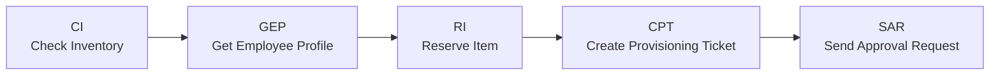
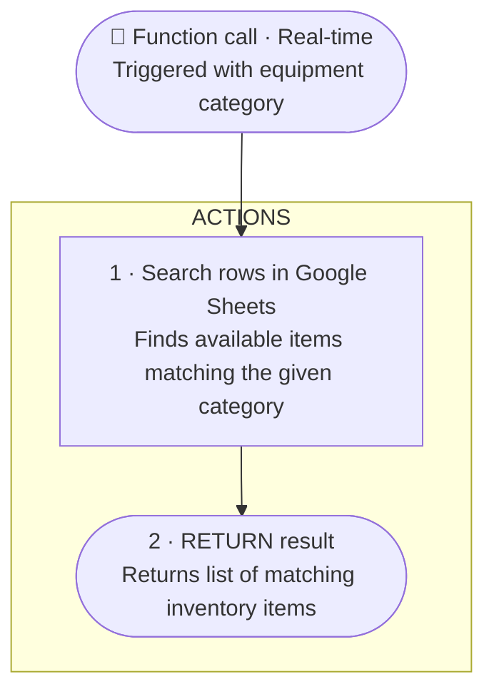
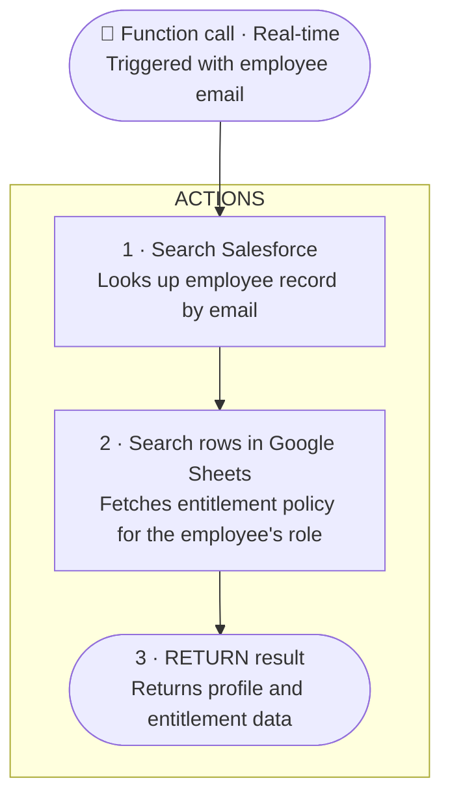
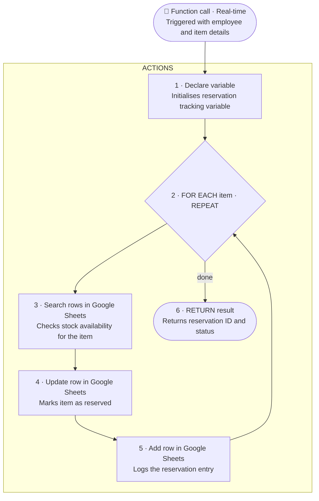
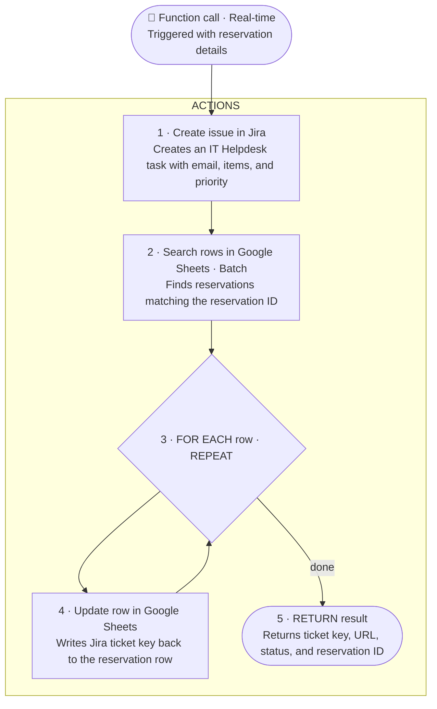
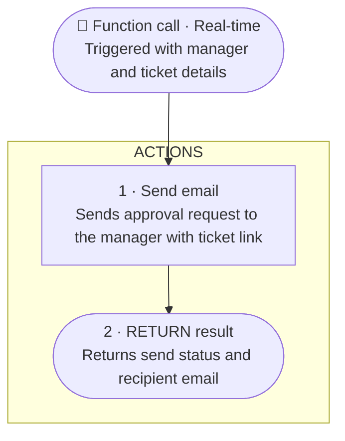

# ATLAS — IT Equipment Provisioning MCP Server

ATLAS is a Workato-based MCP (Managed Content Processing) server that automates IT equipment provisioning for employees. It handles the full lifecycle from inventory check to approval — using Google Sheets, Salesforce, Jira, and Email.

---

## Recipes

| Code | Recipe | Description |
|------|--------|-------------|
| `CI` | check_inventory | Looks up available equipment by category |
| `GEP` | get_employee_profile | Fetches employee details and entitlements |
| `RI` | reserve_item | Reserves equipment items for an employee |
| `CPT` | create_provisioning_ticket | Creates a Jira ticket and logs the reservation |
| `SAR` | send_approval_request | Sends an approval email to the manager |

---

## Architecture

The recipes work together in a sequence to fulfil an equipment request:



---

## Recipe Flows

### CI — Check Inventory

**Inputs:** `category`  
**Outputs:** `items`



---

### GEP — Get Employee Profile

**Inputs:** `employee_email`  
**Outputs:** `employee_id`, `full_name`, `role`, `department`, `manager_email`, `entitlement`



---

### RI — Reserve Item

**Inputs:** `employee_email`, `employee_id`, `employee_full_name`, `items`  
**Outputs:** `reservation_id`, `status`



---

### CPT — Create Provisioning Ticket

**Inputs:** `employee_email`, `reservation_id`, `priority`, `items`  
**Outputs:** `ticket_key`, `ticket_url`, `status`, `reservation_id`



---

### SAR — Send Approval Request

**Inputs:** `manager_email`, `employee_name`, `items`, `ticket_url`, `reservation_id`  
**Outputs:** `status`, `sent_to`



---

## Integrations

| Service | Used in |
|---------|---------|
| Google Sheets | CI, RI, CPT, GEP |
| Salesforce | GEP |
| Jira | CPT |
| Email | SAR |

---

## How to Import

1. Download the `.recipe.json` file for the recipe you want
2. In Workato, go to **Projects → Import**
3. Upload the JSON file
4. Configure the connections (Google Sheets, Salesforce, Jira, Email) to match your workspace

---

## Project Structure

```
ATLAS/
├── README.md
├── ci_rec_check_inventory.recipe.json
├── gep_rec_get_employee_profile.recipe.json
├── ri_rec_reserve_item.recipe.json
├── cpt_rec_create_provisioning_ticket.recipe.json
└── sar_rec_send_approval_request.recipe.json
```
